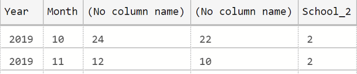
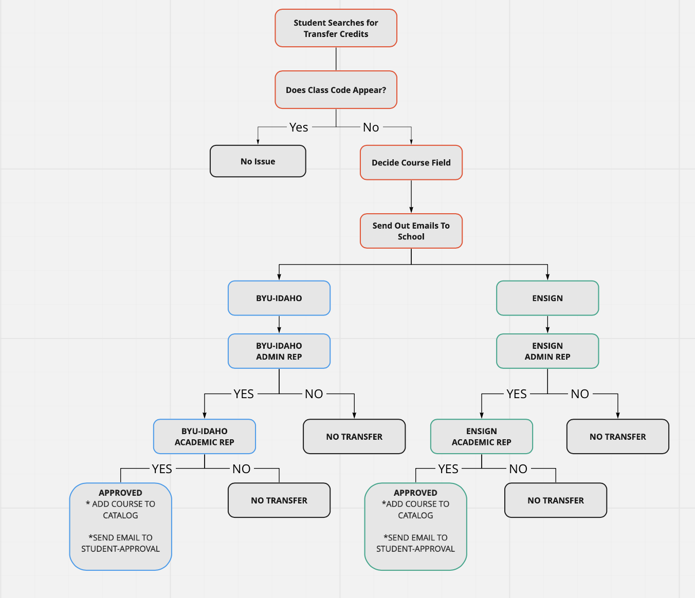
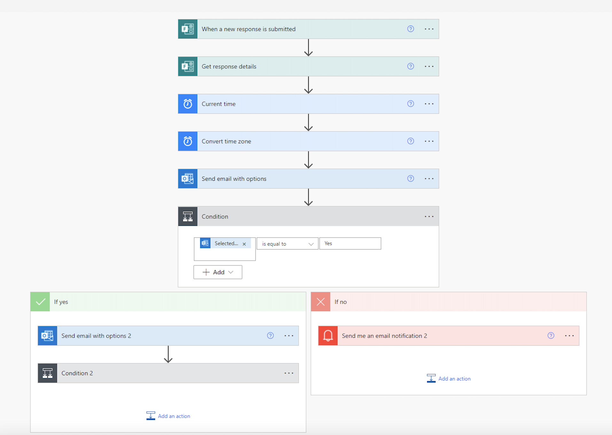

 Jan. 11 2022 - April 13, 2022 

***

    <u>BYU-Pathway Internship Projects</u>

1. Python Coding

 
One of the first projects I completed required me to select, read, clean, and save a file to a csv file to a preselected location.

 <b>Purpose:</b> Rewrite R code into Python that we clean the called spreadsheet and then make a date time column that had a specific order.  This spreadsheet would then be used in PowerBi dashboards and other analysis.

Project Details:

<ul>
<ul>
  <li>The project had been previously completed in R, so I first had to go through the R code and understand what each line was doing.</li>
  <li>To help me create effective classes, I wrote out on a piece of paper what I would like each class to do.  I ended up with:
</ul>
</ul>

<ul>
<ul>
    <ul>
    <li>Main: Where the file location would be pasted.</li>
    <li>Director: Would call all the functions from other classes to be ran in one location.  </li>
    <li>Read: This class was in charge of opening and cleaning the excel spreadsheet. (headers, NA's,variable types)  </li>
    <li>Date: This is where the new desired date time column was made.  Combine various date type rows along with time into a new usealbe column. </li>
    </ul>
  </li>
  <li>The output from running this code is two saved csv files.</li>
</ul>
</ul>

 <b>Summary:</b>  I believe that because this project was written in a clean and understandable way, future employes will be able to use my code without any errors and be able to make changes if needed.

2. Azure Data Studio

<b>Purpose:</b> To write a query that tp  pull out specific information from various tables.  From this tables leaders should be able to observe trends and create predictions.

<ul>
<ul>
  <li>This project required a good knowledge of tables and SQL querying skills.  The table below show the final result I was working towards.</li>
</ul>
</ul>

<ul>
<ul>
  <li>Having had some experience in SQL, I had already a good understanding of how queries were run and the required syntax; however, there were some aspects that required further study to apply.</li>
  <ul>
  <li>One concept I had to look up was subqueries. In the code below,you can see that I created a subquery in the first FROM clause.  This was required because I needed to link up multiple tables inorder to get all the needed info.</li>
  <li>Another concept I got to practice was working with multiple joins.  Finding out how to get them all connected within a subquery proved to be a challenge. </li>
  </ul>
</ul>
</ul>

<code style="background:lightgrey;color:black;"> Below is the query done in Azure Data Studio</code>

~~~

SELECT CONCAT_WS('-',SUBSTRING(t1.[DATE],1,4),SUBSTRING(t1.[DATE],6, 8)) AS 'Date',
    SUBSTRING(t1.[DATE],1,4) AS 'Year',
    CAST(SUBSTRING(t1.[DATE],6, 8) AS numeric) AS 'Month',
    t1.[Total Enrollement], 
    t2.[School_1],
    ISNULL(t3.[School_2],0) AS 'School_2'
FROM(
SELECT CONCAT_WS('-', DATEPART(year, MODIFIED_DATE),
    DATEPART(month, MODIFIED_DATE)) AS 'DATE',
    COUNT(*) AS 'Total Enrollement'
FROM dbo.PERSON_DEGREE
GROUP BY DATEPART(year, MODIFIED_DATE), DATEPART(month, MODIFIED_DATE)
) t1
LEFT JOIN (SELECT CONCAT_WS('-', DATEPART(year, pd.MODIFIED_DATE),
DATEPART(month, pd.MODIFIED_DATE)) AS 'DATE',
    COUNT(*) AS 'School_1'
FROM dbo.PERSON_DEGREE as pd
WHERE pd.PROVIDER_ID = 8389
GROUP BY DATEPART(year,pd. MODIFIED_DATE), DATEPART(month, pd.MODIFIED_DATE)
) t2
ON t2.[DATE] = t1.[DATE]
LEFT JOIN (SELECT CONCAT_WS('-', DATEPART(year, pd.MODIFIED_DATE),
    DATEPART(month, pd.MODIFIED_DATE)) AS 'DATE',
    COUNT(*) AS 'School_2'
FROM dbo.PERSON_DEGREE as pd
JOIN dbo.PROVIDER as p
ON pd.PROVIDER_ID = p.PROVIDER_ID
WHERE pd.PROVIDER_ID = 8391
GROUP BY DATEPART(year, pd.MODIFIED_DATE), DATEPART(month, pd.MODIFIED_DATE)
) t3 
ON (t1.[DATE] = t3.[DATE] AND t2.[DATE]=t3.[DATE])
ORDER BY t1.[DATE]
~~~

<b>Summary:</b>  From this project, I was able to advance my skills in SQL queries while learning about Azure.  With the table created, my manager was able to use it to make decisions on how student enrollment was going.

3. Microsoft Power Automate

<b>Purpose:</b>  To create an automated flow that automate the process of getting approval to add a course to the credit transfer list.

<ul>
<ul>
  <li>To initiate the project, it was important to know the correct steps. With automate, various programs are going to be connected in one fluid flow, so order and reason matters.</li>
  <li>To begin, I created the flow diagram below, it helped:</li>
  <ul>
  <li>Know where branches would occur.</li>
  <li>Understand the conditions that would be required to put in place. </li>
  </ul>
</ul>
</ul>

 <b>Summary:</b> From this project I was able to my organization skills to creating a functioning flow that would complete various tasks without user help.

4. Microsoft Power Virtual Agent

<b>Purpose:</b>  Aid in the construction of a bot that could help students find answers to relatively easy questions without requiring a human agent.

<ul>
<ul>
  <li>To start off, I watched a lot of tutorials on how to start up a new bot.</li>
  <ul>
   <li>It was important to learn how to create trigger words - words that started bot actions</li>
    <li>I also learned how think about bot logic, which is how a conversation should flow and be handled.</li>
  </ul>
   <li>The specific project I helped with was combining multiple topics into one.  This required being observant in connections and understanding pathway flow.</li>
</ul>
</ul>

<b>Summary:</b>  I learned that this program can be very helpful because there are questions that are super simple and don't require a human agent to answer.

5. R Studio

During the course of the internship, R Studio was used various times.  Often times, I wanted to see how the relationship between several variables, and for this reason I would use R.

 In one project, I was creating a goal line that was to be similar to the past year.  After manipulating the data and using ggplot2, I created a few visuals to help my leaders see my predictions.

 For another project, I was looking at semester start and end dates to see how long a course took for each student.

4. Power Bi

 Most projects had to be turned into dashboards and presented to leaders; the tool Pathway used for these type of projects was Power Bi.

 One of the pros for using Power Bi was the ability to publish dashboards and still be able to make changes or updates to the original file.  I was able to use Power Query Editor multiple times to make changes to the data or make new calculations.

 Another important skill in Power Bi that I was able to use was creating visuals that used multiple data sets. In order to do so, you have know what the data looks like and how the data is arranged.

***
